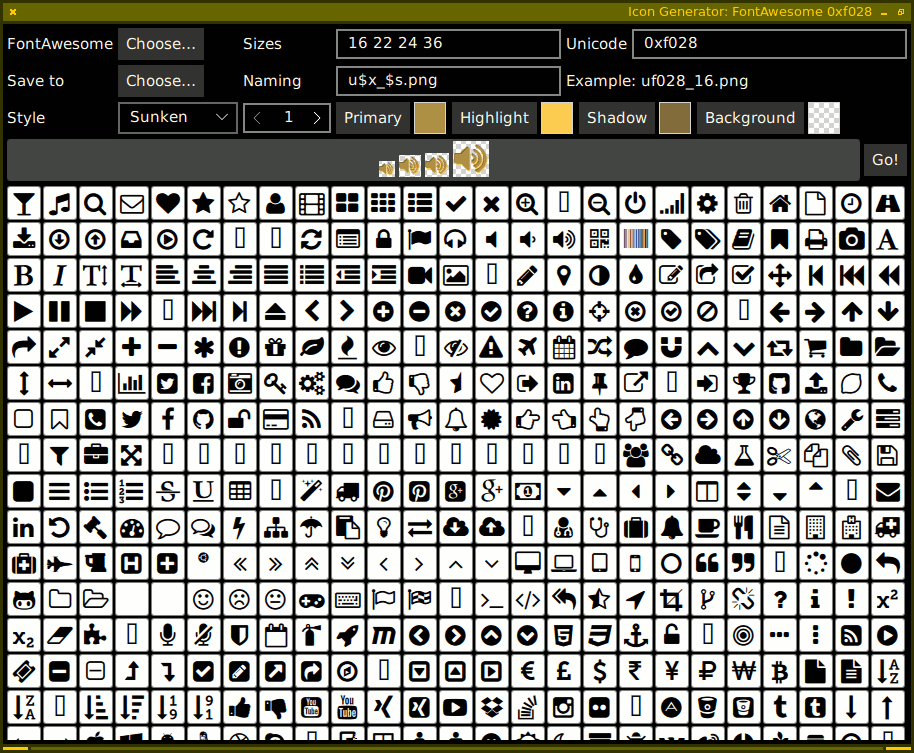

# icongen.qml

A tool for browsing icon fonts and generating pixmaps

You only need the icongen.qml file.  Assuming the "qml" runtime is in your
path, you can run it directly (it's a QML script with a shebang line, like any
shell, perl or python script). Should work fine with Qt 6.4 or newer.  (Older
versions in git history were for Qt 5.8 or newer)

So far it works best with icon fonts like FontAwesome or those that you can
build on fontello.com, because it assumes the glyphs of interest are those with
Unicode codepoints over 0xF000.  If the font that you would like to use is
installed as a system font, use the Font… dialog to select it. Or you can
choose a ttf or otf file with the File… dialog.

